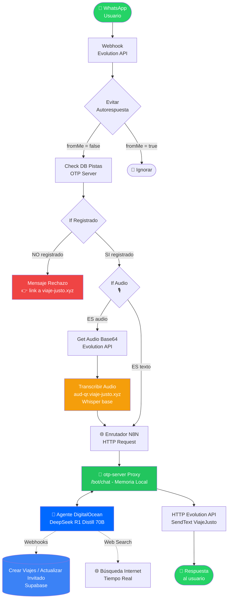
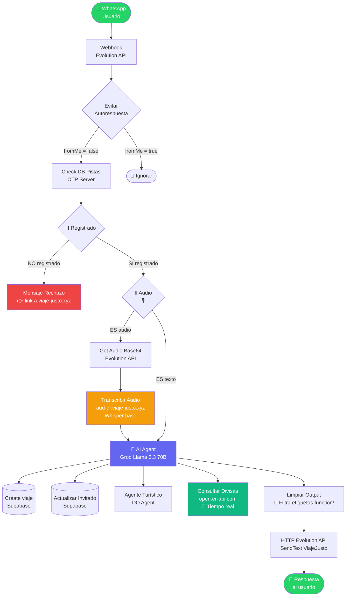

# 🌎 ViajeJusto — Plataforma de Gestión de Viajes con IA

<p align="center">
  <strong>Organiza viajes individuales y grupales con un asistente IA por WhatsApp y un dashboard web inteligente</strong>
</p>

---

## 📋 Tabla de Contenidos

- [Descripción General](#descripción-general)
- [Novedades Recientes](#-novedades-recientes)
- [Arquitectura del Sistema](#arquitectura-del-sistema)
- [Stack Tecnológico](#stack-tecnológico)
- [Estructura del Proyecto](#estructura-del-proyecto)
- [Agente IA (Microservicio Python)](#agente-ia-microservicio-python)
- [Configuración e Instalación](#configuración-e-instalación)
- [Variables de Entorno](#variables-de-entorno)
- [Base de Datos (Supabase)](#base-de-datos-supabase)
- [Bot IA WhatsApp (n8n)](#bot-ia-whatsapp-n8n)
- [Evolution API (WhatsApp)](#evolution-api-whatsapp)
- [Despliegue (Easypanel + Docker)](#despliegue-easypanel--docker)
- [Flujo de Autenticación](#flujo-de-autenticación)
- [Endpoints del API](#endpoints-del-api)
- [Troubleshooting](#troubleshooting)

---

## Descripción General

**ViajeJusto** es una plataforma web + WhatsApp para organizar y gestionar viajes individuales y grupales. Incluye:

- 🔐 **Registro con doble verificación** (WhatsApp OTP + Email)
- 🤖 **Asistente IA por WhatsApp** (Travel-Just) que crea viajes, busca hoteles, gestiona presupuestos y entiende notas de voz
- 👥 **Gestión de viajes grupales** con invitaciones por link, control de presupuesto y gastos compartidos
- 📷 **Escáner IA en el dashboard** para leer QR y códigos de barras de recibos y registrar gastos automáticamente
- 🎙️ **Transcripción de notas de voz** en WhatsApp usando Whisper (faster-whisper)
- 💱 **Tipo de cambio en tiempo real** (USD, EUR, COP, MXN, etc.)
- 🛡️ **Panel de administración** con estadísticas, gestión de usuarios y monitoreo del sistema

---

## 🆕 Novedades Recientes

### v2.2 — Auditoría de Seguridad & Compliance (Abril 2026)

Se blindó la infraestructura completa contra ataques de día cero y vulnerabilidades expuestas:
- **Enmascaramiento Térmico de Secretos**: Migración total de tokens quemados (Supabase JWT, Evolution API, Resend, DO Agent) hacia un entorno estricto de variables locales (`.env`).
- **Mitigación Anti-DDoS y OTP Bombing**: Cortafuegos de red integrado mediante `express-rate-limit` que bloquea IPs que generen peticiones abusivas en los verificadores SMS y de correo electrónico.
- **Defensa Activa (SecHeaders)**: Inyección forzosa de cabeceras anti-Sniffing y ejecución (`X-Frame-Options`, `Content-Security-Policy`, `HSTS`) y eliminación absoluta de fugas lógicas de tecnología backend (`X-Powered-By`).
- **Resolución CVE y Honeypot SPA**: Patches limpios pasados por `npm audit fix` reduciendo los riesgos crónicos de Vite y Node.js a **0 vulnerabilities**. Los motores SPA interceptan y devuelven 404 a escáneres torpes buscando wp-admin.

### v2.1 — Migración a DigitalOcean GenAI Agent (Abril 2026)

Se refactorizó por completo el flujo de Inteligencia Artificial para eliminar las caídas de contexto causadas por LangChain y n8n:
- **Enrutamiento Puro**: n8n ahora funciona únicamente como un túnel rápido sin estado.
- **Microservicio Proxy**: El gestor local `otp-server` retiene memoria persistente a corto plazo por usuario y gestiona las conexiones.
- **DeepSeek R1 Distill**: Todo el razonamiento y Búsqueda Web (Divisas/Noticias) vive ahora dentro un Agente de DigitalOcean.
- **Herramientas Blindadas**: Las operaciones directas a Supabase (crear viajes y actualizar invitados) se protegen como Node.js Endpoints en el servidor central que DigitalOcean invoca con total certeza estructural.

### v2.0 — Integración del Agente IA Python (Abril 2026)

#### 🎙️ Notas de Voz en WhatsApp
El bot **Travel-Just** ahora entiende notas de voz. Cuando un usuario envía un audio:
1. Evolution API descarga el audio y lo convierte a base64
2. El agente de IA Python transcribe el audio con **Faster-Whisper** (modelo `base`)
3. El texto transcripto se entrega como input al AI Agent de n8n
4. El bot responde de forma natural al contenido del audio

**Precisión mejorada:** Se usa el modelo Whisper `base` (145 MB) para mejor reconocimiento de fechas y números en español.

#### 📷 Escáner QR / Código de Barras en el Dashboard
Endpoint usado: `POST https://aud-qr.viaje-justo.xyz/vision/scan-qr`

---

## Arquitectura del Sistema



---

## Stack Tecnológico

| Componente | Tecnología | Versión |
|---|---|---|
| Frontend | Vue 3 + TypeScript + Vite | 3.5+ |
| Backend / API | Node.js + Express | 20+ |
| Base de Datos | Supabase (PostgreSQL) | Self-hosted |
| Auth | Supabase Auth + OTP personalizado | — |
| WhatsApp | Evolution API | v2.3.7 |
| IA / LLM | Groq (Llama 3.3 70B Versatile) | — |
| Orquestación IA | n8n (LangChain Agent) | — |
| **Agente IA Python** | **FastAPI + OpenCV + pyzbar + Faster-Whisper** | **2.0** |
| **Transcripción de voz** | **Faster-Whisper (modelo base)** | **1.0.3** |
| **Tipo de cambio** | **open.er-api.com** | **Free tier** |
| Correo | Resend API | — |
| Proxy reverso | Traefik + Nginx | 3.6.7 |
| Contenedores | Docker + Easypanel | — |
| DNS/CDN | Cloudflare | — |
| Process Manager | PM2 | — |

---

## Estructura del Proyecto

```
N8N/
├── src/                              # Frontend Vue.js
│   ├── views/
│   │   ├── Login.vue                # Pantalla de login
│   │   ├── Signup.vue               # Registro con OTP
│   │   ├── DashboardUser.vue        # Panel del usuario (viajes, campo ciudad)
│   │   ├── DashboardAdmin.vue       # Panel admin (stats, usuarios)
│   │   ├── TripDetail.vue           # Detalle de viaje + Escáner QR/Barcode IA
│   │   └── JoinTrip.vue             # Unirse a viaje grupal por link
│   ├── stores/
│   │   └── auth.ts                  # Store Pinia para sesión y rol
│   ├── router/
│   │   └── index.ts                 # Rutas con guards de autenticación
│   ├── supabase.ts                  # Configuración del cliente Supabase
│   ├── App.vue                      # Componente raíz
│   ├── main.ts                      # Entry point
│   └── style.css                    # Estilos globales Material Design 3
│
├── agent-python/                    # 🆕 Microservicio IA (FastAPI)
│   ├── main.py                      # API FastAPI con endpoints de visión y audio
│   ├── requirements.txt             # Dependencias Python
│   └── Dockerfile                   # Imagen Docker (pre-descarga Whisper base)
│
├── otp-package/                     # Servidor OTP (Express)
│   ├── server.js                    # Lógica OTP, admin API, bot endpoints
│   ├── Dockerfile
│   └── package.json
│
├── public/                          # Archivos estáticos servidos en producción
│   ├── favicon.svg
│   └── viajejusto-n8n-flow.json    # 🆕 Flujo n8n descargable desde la web
│
├── supabase_schema.sql              # Schema SQL maestro
├── flujo_whatsapp_n8n_v3.json       # 🆕 Flujo n8n completo (v2.0 con audio)
├── nginx.conf                       # Configuración Nginx
├── docker-compose.yml               # Docker Compose global
├── .env.example                     # Template de variables de entorno
├── package.json
├── vite.config.ts
├── tsconfig.json
└── README.md
```

---

## Agente IA (Microservicio Python)

El agente IA es un microservicio **FastAPI** desplegado en un VPS dedicado, accesible en `https://aud-qr.viaje-justo.xyz`.

### Endpoints

| Método | Ruta | Descripción |
|---|---|---|
| `GET` | `/health` | Verifica que el servicio está activo |
| `POST` | `/vision/scan-qr` | Escanea QR o código de barras (imagen FormData) |
| `POST` | `/audio/transcribe` | Transcribe audio (archivo OGG/MP3 FormData) |
| `POST` | `/audio/transcribe-base64` | Transcribe audio en base64 JSON (usado por n8n) |

### Despliegue en Easypanel

1. En Easypanel → proyecto `supabase` → **Add Service** → **App**
2. Configurar repo: `https://github.com/elbuhonerodev/viaje-justo.git`
3. Directorio: `agent-python/`
4. Puerto: `8000`
5. Dominio: `aud-qr.viaje-justo.xyz`
6. Hacer **Deploy**

> ⚠️ El primer build tarda ~5-7 minutos porque descarga el modelo Whisper `base` (~145 MB).

### Dependencias clave

```
fastapi==0.110.0
uvicorn==0.27.1
opencv-python-headless==4.9.0.80
pyzbar==0.1.9
faster-whisper==1.0.3
requests==2.31.0
huggingface_hub==0.23.4
```

---

## Configuración e Instalación

### Requisitos Previos

- Node.js 20+
- Docker y Docker Compose
- Cuenta de Supabase (self-hosted o cloud)
- Cuenta de Cloudflare
- Instancia de Evolution API
- Instancia de n8n
- Cuenta de Groq (API key)
- Cuenta de Resend (API key)

### 1. Clonar el repositorio

```bash
git clone https://github.com/elbuhonerodev/viaje-justo.git
cd viaje-justo
```

### 2. Instalar dependencias

```bash
# Frontend
npm install

# Backend OTP
cd otp-package && npm install && cd ..
```

### 3. Configurar variables de entorno

```bash
cp .env.example .env
# Editar .env con tus valores reales
```

### 4. Configurar la base de datos

Ejecuta en el SQL Editor de Supabase:
```sql
-- Schema completo
\i supabase_schema.sql

-- Campo ciudad (si actualizas desde v1.x)
ALTER TABLE public.viajes ADD COLUMN IF NOT EXISTS ciudad TEXT;
```

### 5. Iniciar en desarrollo

```bash
# Frontend (Vite dev server)
npm run dev

# Backend OTP (en otra terminal)
cd otp-package && node server.js
```

### 6. Build para producción

```bash
npm run build
# Los archivos quedan en dist/ — copiar al servidor otp-server
```

---

## Variables de Entorno

```env
# Supabase
VITE_SUPABASE_URL=https://supabase.viaje-justo.xyz
VITE_SUPABASE_ANON_KEY=tu_anon_key

# Servidor OTP
OTP_SERVER_URL=http://159.89.122.250:3001

# Evolution API
EVOLUTION_API_URL=https://ws-manager.viaje-justo.xyz
EVOLUTION_API_KEY=tu_api_key
EVOLUTION_INSTANCE=ViajeJusto

# Resend
RESEND_API_KEY=tu_resend_key

# Groq (usado en n8n, no en .env local)
GROQ_API_KEY=tu_groq_key
```

---

## Base de Datos (Supabase)

### Tablas principales

| Tabla | Descripción |
|---|---|
| `usuarios` | Usuarios registrados (id, nombre, email, whatsapp, role) |
| `viajes` | Viajes creados (pais, **ciudad**, fecha, moneda, presupuesto) |
| `participantes` | Participantes de viajes grupales (viaje_id, nombre, aporte) |
| `gastos` | Gastos registrados por viaje (concepto, categoria, monto, foto_url) |
| `otps` | Códigos OTP temporales para verificación |

### Políticas RLS

Todas las tablas tienen Row Level Security activo. Los usuarios solo pueden leer/escribir sus propios datos.

---

## Bot IA WhatsApp (n8n)

### 📥 Descargar Flujo Actualizado

> El flujo se actualiza automáticamente con cada nuevo push al repositorio.

**↓ Descarga directa del JSON:**

```
https://viaje-justo.xyz/viajejusto-n8n-flow.json
```

O desde el repositorio local: [`flujo_whatsapp_n8n_v3.json`](./flujo_whatsapp_n8n_v3.json)

### Importar en n8n

1. Abre tu instancia n8n
2. **Workflows** → **⋮** → **Import from URL**
3. Pega: `https://viaje-justo.xyz/viajejusto-n8n-flow.json`
4. Configura las credenciales (Groq, Supabase)
5. Activa el workflow ✅

---

### Diagrama del Flujo (v2.0)



### Flujo de mensajes — Descripción por nodos

| # | Nodo | Tipo | Función |
|---|---|---|---|
| 1 | **Webhook** | Trigger | Recibe mensajes de Evolution API |
| 2 | **Evitar Autorespuesta** | IF | Descarta mensajes enviados por el propio bot |
| 3 | **Check DB Pistas** | HTTP | Verifica si el número está registrado en la plataforma |
| 4 | **If Registrado** | IF | Divide entre usuario registrado y no registrado |
| 5 | **Mensaje Rechazo** | HTTP | Envía link de registro si el usuario no existe |
| 6 | **If Audio** | IF | Detecta si el mensaje es una nota de voz |
| 7 | **Get Audio Base64** | HTTP | Descarga el audio de WA vía Evolution API |
| 8 | **Transcribir Audio** | HTTP | Envía el base64 al agente Whisper (`/audio/transcribe-base64`) |
| 9 | **AI Agent** | LangChain | Procesa el texto (transcripto o directo) con Groq Llama 3.3 |
| 10 | **Limpiar Output** | Code (JS) | Elimina etiquetas `<function/>` del output del LLM |
| 11 | **HTTP Evolution API** | HTTP | Envía la respuesta limpia al usuario por WhatsApp |

### Herramientas del AI Agent

| Herramienta | Cuándo se usa | Fuente de datos |
|---|---|---|
| Create viaje | Usuario quiere registrar un viaje | Supabase |
| Actualizar Invitado | Invitado quiere cambiar nombre/aporte | Supabase |
| Agente Turístico (DO) | Hoteles, restaurantes, vuelos, rutas | DigitalOcean AI Agent |
| **Consultar Divisas** | **Tipo de cambio en tiempo real** | **open.er-api.com** |


---

## Evolution API (WhatsApp)

- **URL:** `https://ws-manager.viaje-justo.xyz`
- **Instancia:** `ViajeJusto`
- **Webhook configurado en:** `https://n8n.viaje-justo.xyz/webhook/evolution-chat/messages-upsert`

### Endpoints clave utilizados

```bash
# Enviar mensaje de texto
POST /message/sendText/ViajeJusto

# Obtener base64 de un mensaje multimedia (audio)
POST /chat/getBase64FromMediaMessage/ViajeJusto
```

---

## Despliegue (Easypanel + Docker)

### Servicios en producción

| Servicio | Puerto | Dominio |
|---|---|---|
| otp-server | 3001 | viaje-justo.xyz |
| Evolution API | 8080 | ws-manager.viaje-justo.xyz |
| n8n | 5678 | n8n.viaje-justo.xyz |
| Supabase | — | supabase.viaje-justo.xyz |
| **agente-ia (Python)** | **8000** | **aud-qr.viaje-justo.xyz** |

### Despliegue del frontend

```bash
npm run build
docker cp dist/. otp-server:/app/dist/
```

---

## Flujo de Autenticación

```
1. Usuario ingresa email + teléfono en /signup
2. Sistema envía OTP por WhatsApp (Evolution API)
3. Sistema envía link de confirmación por Email (Resend)
4. Usuario confirma email (Supabase Auth)
5. Usuario ingresa OTP de WhatsApp
6. Backend valida OTP y crea sesión (Supabase session)
7. Usuario accede al dashboard según su rol (admin/invitado)
```

---

## Endpoints del API

### OTP Server (Express — Puerto 3001/3002)

| Método | Ruta | Descripción |
|---|---|---|
| `POST` | `/otp/send` | Genera y envía OTP por WhatsApp |
| `POST` | `/otp/verify` | Valida el OTP ingresado |
| `POST` | `/bot/checkUser` | Verifica si un número está registrado (usado por n8n) |
| `GET` | `/admin/stats` | Estadísticas globales (admin) |
| `GET` | `/admin/users` | Lista de usuarios (admin) |
| `DELETE` | `/admin/users/:id` | Eliminar usuario (admin) |

### Agente IA Python (FastAPI — Puerto 8000)

| Método | Ruta | Descripción |
|---|---|---|
| `GET` | `/health` | Estado del servicio |
| `POST` | `/vision/scan-qr` | Escanea QR o código de barras |
| `POST` | `/audio/transcribe` | Transcribe audio (FormData) |
| `POST` | `/audio/transcribe-base64` | Transcribe audio (JSON base64, usado por n8n) |

---

## Troubleshooting

### El bot no responde audios
1. Verificar que el agente IA esté activo: `curl https://aud-qr.viaje-justo.xyz/health`
2. Verificar que `/audio/transcribe-base64` retorna 200 (no 404)
3. Si hay error de módulo Python (`No module named 'requests'`): hacer Redeploy en Easypanel

### El bot da tipos de cambio incorrectos
- Verificar que el nodo **"Consultar Divisas"** esté conectado al AI Agent en n8n
- Probar la API directamente: `curl "https://open.er-api.com/v6/latest/USD" | grep COP`

### El bot muestra etiquetas `<function/...>` en WhatsApp
- Verificar que el nodo **"Limpiar Output"** esté entre "AI Agent" y "HTTP Request Evolution API"
- Reimportar el flujo desde `https://viaje-justo.xyz/viajejusto-n8n-flow.json`

### El escáner QR del dashboard no funciona
- Verificar CORS en el agente IA (está configurado `allow_origins=["*"]`)
- Verificar que el dominio `aud-qr.viaje-justo.xyz` tenga certificado SSL válido

### Error al crear viaje (campo `ciudad`)
```sql
-- Ejecutar en Supabase SQL Editor si el campo no existe
ALTER TABLE public.viajes ADD COLUMN IF NOT EXISTS ciudad TEXT;
```

### Build del agente IA falla en Easypanel
- Verificar que el Dockerfile apunta a `agent-python/` como contexto
- El modelo Whisper `base` (~145 MB) necesita internet durante el build
- El build puede tardar hasta 7 minutos en la primera vez

---

## Changelog

### v2.2.0 (Abril 2026)
- ✅ Extracción criptográfica de llaves críticas a ambiente `.env` (Zero Hardcoded Secrets).
- ✅ Rate-limits para detener inyección y ataques de fuerza bruta en endpoints transaccionales OTP.
- ✅ Resoluciones CVE a vulnerabilidades de dependencias frontend/backend (`npm audit fix`).
- ✅ Incorporación de SiteMap XML general automatizado y Robots.txt permisivo.
- ✅ Mejoras en la estructura semántica Documental Frontend para Screen-readers/SEO (etiquetas H2).
- ✅ Capa protectora global de Headers de seguridad HTTP (XSS, CSP, HSTS, Permisos) operando activamente.

### v2.0.0 (Abril 2026)
- ✅ Agente IA Python desplegado (FastAPI + OpenCV + Whisper)
- ✅ Transcripción de notas de voz en WhatsApp (Faster-Whisper `base`)
- ✅ Escáner QR y códigos de barras en el dashboard (TripDetail.vue)
- ✅ Tipo de cambio en tiempo real (open.er-api.com)
- ✅ Nodo "Limpiar Output" para filtrar etiquetas `<function/>` del LLM
- ✅ System prompt reescrito para formato WhatsApp (párrafos cortos, emojis, negrita)
- ✅ Campo `ciudad` añadido a viajes (Supabase + dashboard + bot)
- ✅ Flujo n8n v3 con pipeline de audio (If Audio → Get Base64 → Whisper → AI Agent)
- ✅ Mensaje de rechazo mejorado con link de registro directo

### v1.0.0 (Marzo 2026)
- ✅ Plataforma inicial con registro OTP dual (WhatsApp + Email)
- ✅ Bot Travel-Just con creación de viajes y búsqueda turística
- ✅ Dashboard web (usuario + admin)
- ✅ Gestión de viajes grupales con presupuesto compartido
